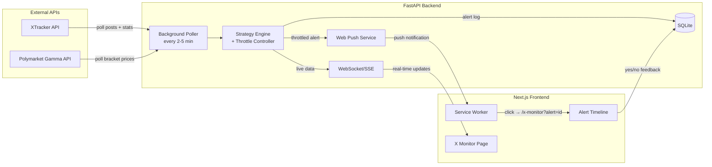

# Musk Tweet Monitor - X Monitor 模块设计方案

> 为 zenTrade 新增 "X Monitor" 模块，通过轮询 XTracker API（Polymarket 官方结算源）监控 Elon Musk 发推动态，结合 Polymarket Gamma API 获取市场价格，根据模板化策略实例触发浏览器推送通知，辅助用户在 Polymarket 推文计数市场上做出决策。策略告警时间轴是 V1 核心交互，API 异常作为独立机会信号。

## 数据源架构

完全基于两个免费公开 API，无需 X API：

- **XTracker API** (`xtracker.polymarket.com/api`) -- Polymarket 官方结算数据源
  - `GET /users/elonmusk` -- 用户基础信息 + 活跃 tracking periods
  - `GET /users/elonmusk/posts?startDate=...&endDate=...` -- 每条推文内容和精确时间戳
  - `GET /trackings/{id}?includeStats=true` -- 含每小时粒度统计的 tracking 详情（total, pace, daily）
  - 更新频率：约 5 分钟同步一次
- **Polymarket Gamma API** (`gamma-api.polymarket.com`)
  - `GET /events?slug={slug}` -- 获取市场事件及所有 bracket（约 30 个区间），含实时价格
  - XTracker tracking 的 `marketLink` 字段可直接提取 slug



## 后端设计

### 新增路由

**监控数据**：

- `GET /api/xmonitor/status` -- 当前监控状态（发帖计数、距上次发帖时间、剩余时间、pace、活跃 tracking 列表、API 健康状态）
- `GET /api/xmonitor/markets` -- 活跃市场列表 + 各 bracket 价格（含 Polymarket 下单链接）
- `GET /api/xmonitor/tracking/{id}` -- 某个 tracking period 的详细统计
- `GET /api/xmonitor/posts` -- 近期推文列表

**策略管理 CRUD**：

- `GET /api/xmonitor/strategies` -- 所有策略实例列表
- `POST /api/xmonitor/strategies` -- 创建策略实例（选择模板 + 设参数）
- `PUT /api/xmonitor/strategies/{id}` -- 更新策略实例参数/启停状态
- `DELETE /api/xmonitor/strategies/{id}` -- 删除策略实例

**告警**：

- `GET /api/xmonitor/alerts` -- 告警历史（支持分页、按 strategy_instance_id / strategy_type 过滤）
- `POST /api/xmonitor/alerts/{id}/feedback` -- 对告警的 yes/no 反馈（含可选 note）

**推送**：

- `POST /api/xmonitor/push/subscribe` -- 注册浏览器推送订阅
- `DELETE /api/xmonitor/push/subscribe` -- 取消推送订阅

**WebSocket**：

- `WS /api/xmonitor/ws` -- 实时推送（新推文、统计变更、新告警、API 健康状态变更）

### Background Poller + API Health Monitor

使用 `asyncio` 后台任务或 `APScheduler`，在 FastAPI 启动时注册：

- 每 2-3 分钟轮询 XTracker `/users/elonmusk/posts` + `/trackings/{active_id}?includeStats=true`
- 每 5 分钟轮询 Polymarket Gamma API（获取 bracket 价格）
- 数据缓存在内存 + 持久化到 SQLite
- 每次轮询后执行 Strategy Engine 评估
- 变更时通过 WebSocket 推送到前端

**API 健康检测**：

- 每次轮询记录 API 响应状态（成功/失败/超时/异常响应）
- 维护 `api_health` 状态：`{ xtracker: "ok"|"error", polymarket: "ok"|"error", last_success_at, error_message }`
- API 从 OK → Error 时：立即推送通知 `"[API DOWN] XTracker 不可用 — 机器人失灵，可能存在价格错配"`
- API 从 Error → OK 时：推送恢复通知
- 前端通过 WebSocket 实时接收健康状态变更

### Strategy Engine（模板化 + 频控 + 可买判断）

**策略管理模型**：用户可基于 4 种策略模板创建多个策略实例，每个实例有独立参数和启停状态。例如可以创建两个 Silent Period：一个 6h 触发每 1h 提醒，一个 12h 触发每 30min 提醒。

**通用频控机制**：每个策略实例维护独立的 throttle state：

```python
class ThrottleState:
    strategy_instance_id: str
    tracking_id: str
    bracket: str | None          # per-bracket strategies (Tail Sweep / Panic Fade)
    last_alert_at: datetime | None
    alert_count: int

    def should_fire(self, now: datetime, interval_minutes: int) -> bool:
        """Check if interval_minutes has passed since last alert"""
        if self.last_alert_at is None:
            return True
        return (now - self.last_alert_at).total_seconds() >= interval_minutes * 60

    def reset(self):
        self.last_alert_at = None
        self.alert_count = 0
```

**通用"可买"判断**：Strategy 3 和 4 共享的前置条件——目标 bracket 的价格还没到极端值，还有筹码可买。默认阈值：No 价格 < 99.5%（即 Yes > 0.5%），用户可调整。

---

**Strategy 1 - Silent Period（沉默期）**

- 条件：距上次发帖超过 `silence_hours`（用户设置，如 6h）
- 频控：首次触发后，按用户设置的 `remind_interval_minutes`（如 60min）重复提醒
- 重置条件：检测到新推文后重置，停止该轮提醒
- 可配置参数：`silence_hours`, `remind_interval_minutes`
- 告警内容：当前沉默时长、已发数/pace、距结算剩余时间

**Strategy 2 - Tail Sweep（扫尾盘）**

- 条件：当前计数已超过某 bracket 下限，该 bracket Yes 价格 >= `min_yes_price`（默认 99%）
- 频控：每个 bracket 仅触发 **1 次**
- Polymarket 推文计数市场**无交易手续费**
- 可配置参数：`min_yes_price`
- 告警内容：bracket 区间、当前 Yes 价格

**Strategy 3 - Settlement No（结算期 No）**

- 条件：
  1. 剩余时间 < `remaining_hours`（默认 12h）
  2. 距尚未达到的 bracket 还差 `min_gap` 条（默认 100+）
  3. **该 bracket 的 No 价格 < `max_no_price`**（默认 99.5%），即还有买入空间
- 频控：用户设置 `remind_interval_minutes`（默认 120min）
- 重置条件：发帖速度突然加快（pace 显著上升）时暂停
- 可配置参数：`remaining_hours`, `min_gap`, `max_no_price`, `remind_interval_minutes`
- 告警内容：剩余时间、还差多少条、当前 No 价格、pace 分析

**Strategy 4 - Panic Fade（恐慌盘收割）**

- 条件：
  1. 剩余时间 < `remaining_hours`（默认 2h）
  2. 扫描所有尚未达到的 bracket，筛选出还差 `min_gap` 条（默认 50+）的
  3. **这些 bracket 的 Yes 价格 > `min_yes_price`**（默认 5%），说明有人在恐慌性买 Yes
  4. 即：基本不可能达到，但市场定价偏高 → 买 No 收割错配
- 操作方向：**买 No**
- 频控：每个 bracket 仅触发 **1 次**
- 可配置参数：`remaining_hours`, `min_gap`, `min_yes_price`
- 告警内容：bracket 列表（可能多个同时满足）、各 bracket 的 Yes 价格、还差条数、剩余时间

### 数据模型新增

```python
# xmonitor_push_subscriptions - Web Push 订阅
class PushSubscription:
    id: str
    endpoint: str
    p256dh: str
    auth: str
    created_at: datetime

# xmonitor_strategy_instances - 策略实例（用户创建和管理）
class StrategyInstance:
    id: str
    strategy_type: str       # "silent_period" | "tail_sweep" | "settlement_no" | "panic_fade"
    name: str                # user-defined name, e.g., "沉默6h提醒"
    enabled: bool
    params: dict             # type-specific params:
                             # silent_period: { silence_hours, remind_interval_minutes }
                             # tail_sweep: { min_yes_price }
                             # settlement_no: { remaining_hours, min_gap, max_no_price, remind_interval_minutes }
                             # panic_fade: { remaining_hours, min_gap, min_yes_price }
    created_at: datetime
    updated_at: datetime

# xmonitor_alerts - 策略告警日志
class MonitorAlert:
    id: str
    strategy_instance_id: str  # FK to StrategyInstance
    strategy_type: str         # denormalized for query convenience
    tracking_id: str
    bracket: str | None        # e.g., "240-259"
    trigger_data: dict         # snapshot of context at trigger time
    message: str
    polymarket_url: str        # direct link to Polymarket order page
    feedback: str | None       # "yes" | "no" | None
    feedback_note: str | None
    created_at: datetime
    feedback_at: datetime | None
    push_sent: bool

# xmonitor_api_health - API 健康日志
class ApiHealthLog:
    id: str
    api_name: str              # "xtracker" | "polymarket"
    status: str                # "ok" | "error" | "timeout"
    error_message: str | None
    response_time_ms: int | None
    checked_at: datetime
```

### Web Push 实现

使用 Python `pywebpush` 库，需生成 VAPID 密钥对：

- 新环境变量：`VAPID_PRIVATE_KEY`, `VAPID_PUBLIC_KEY`, `VAPID_EMAIL`
- 前端注册 Service Worker，获取 PushSubscription 对象发送到后端存储
- 策略触发时，后端推送通知，payload 包含 `alert_id` 用于点击跳转定位
- 推送内容示例：`"[Silent Period] 8h no posts | Count: 254 | 9h left | Pace: 290"`

## 前端设计

### 新增路由

- `/x-monitor` -- X Monitor 主面板
- 支持 URL 参数 `?alert={alert_id}` -- 从推送通知点击跳转后自动滚动并高亮该告警

### 侧边栏

在 AppSidebar 中新增 "X Monitor" 导航项（icon: `Radio`），位于 Assets 下方。

### X Monitor 页面布局（V1 — 策略优先）

```
+----------------------------------------------------------+
|  API STATUS BANNER (only visible when error)              |
|  ┌──────────────────────────────────────────────────────┐ |
|  │ ⚠ XTracker API 不可用 (since 14:20) — 机器人失灵，  │ |
|  │   可能存在价格错配                                    │ |
|  └──────────────────────────────────────────────────────┘ |
+----------------------------------------------------------+
|  HEADER                                                   |
|  X Monitor — Elon Musk  [Tracking: Mar 10-17 ▾]         |
|  ┌─────────────────────────────────────────────────────┐  |
|  │ 已发: 254  |  距上次: 2h 14m  |  剩余: 9h 12m      │  |
|  │ Pace: 290  |  日均: 36.3                            │  |
|  │                                                     │  |
|  │ [Open in Polymarket ↗]   [Manage Strategies ⚙]     │  |
|  └─────────────────────────────────────────────────────┘  |
+----------------------------------------------------------+
|  ALERT TIMELINE                                           |
|  [All] [Silent Period] [Tail Sweep] [Settlement No]      |
|  [Panic Fade]    ← strategy type filter tabs              |
|                                                           |
|  Today                                                    |
|  ┌─ 14:32 ─────────────────────────────────────────────┐  |
|  │  ⚠ SILENT PERIOD — "沉默6h提醒"                    │  |
|  │  "8h no posts — possible burst incoming"            │  |
|  │  Count: 254 | Pace: 290 | Remaining: 9h 12m        │  |
|  │  [Open Polymarket ↗]   [Yes ✓]  [No ✗]             │  |
|  └──────────────────────────────────────────────────────┘  |
|  ┌─ 12:15 ─────────────────────────────────────────────┐  |
|  │  🔴 SETTLEMENT NO — "结算12h/100gap"                │  |
|  │  "<6h left, need 120+ more — extremely unlikely"    │  |
|  │  Count: 210 | Gap: 130 | No Price: 92%              │  |
|  │  Remaining: 5h 45m                                  │  |
|  │  [Open Polymarket ↗]   [Yes ✓]  [No ✗]  ← acted   │  |
|  └──────────────────────────────────────────────────────┘  |
|  ┌─ 09:01 ─────────────────────────────────────────────┐  |
|  │  ✅ TAIL SWEEP — "扫尾99%"                          │  |
|  │  "Bracket 200-219 already passed, Yes @ 99.2%"     │  |
|  │  [Open Polymarket ↗]   [Yes ✓]  [No ✗]             │  |
|  └──────────────────────────────────────────────────────┘  |
|                                                           |
|  Yesterday                                                |
|  ┌─ 23:12 ─────────────────────────────────────────────┐  |
|  │  💰 PANIC FADE — "恐慌盘2h/50gap"                   │  |
|  │  Brackets with 50+ gap but Yes still high:          │  |
|  │   • 340-359: need 89 more, Yes @ 8% → buy No       │  |
|  │   • 360-379: need 109 more, Yes @ 6% → buy No      │  |
|  │  [Open Polymarket ↗]   [Yes ✓] ← feedback given    │  |
|  └──────────────────────────────────────────────────────┘  |
|  ...                                                      |
+----------------------------------------------------------+
```

### 策略管理界面

通过头部 "Manage Strategies" 按钮打开（可以是 Sheet/Dialog）：

```
+----------------------------------------------------------+
|  STRATEGY MANAGEMENT                                      |
|  ┌──────────────────────────────────────────────────────┐ |
|  │ [+ Create Strategy]                                  │ |
|  │                                                      │ |
|  │ ┌─ "沉默6h提醒" ──────────── [enabled ●] [Edit] ──┐ │ |
|  │ │ Type: Silent Period                               │ │ |
|  │ │ Params: silence=6h, interval=60min                │ │ |
|  │ └──────────────────────────────────────────────────┘ │ |
|  │ ┌─ "沉默12h加急" ──────────── [enabled ●] [Edit] ──┐ │ |
|  │ │ Type: Silent Period                               │ │ |
|  │ │ Params: silence=12h, interval=30min               │ │ |
|  │ └──────────────────────────────────────────────────┘ │ |
|  │ ┌─ "扫尾99%" ────────────── [enabled ●] [Edit] ──┐  │ |
|  │ │ Type: Tail Sweep                                  │ │ |
|  │ │ Params: min_yes_price=99%                         │ │ |
|  │ └──────────────────────────────────────────────────┘ │ |
|  │ ┌─ "结算12h/100gap" ─────── [disabled ○] [Edit] ─┐  │ |
|  │ │ Type: Settlement No                               │ │ |
|  │ │ Params: remaining=12h, gap=100, max_no=99.5%      │ │ |
|  │ │         interval=120min                           │ │ |
|  │ └──────────────────────────────────────────────────┘ │ |
|  │ ┌─ "恐慌盘2h/50gap" ─────── [enabled ●] [Edit] ──┐  │ |
|  │ │ Type: Panic Fade                                  │ │ |
|  │ │ Params: remaining=2h, gap=50, min_yes=5%          │ │ |
|  │ └──────────────────────────────────────────────────┘ │ |
|  └──────────────────────────────────────────────────────┘ |
+----------------------------------------------------------+
```

创建/编辑时：选择策略模板类型 → 填写名称 + 对应参数 → 保存。

### 核心 UI 组件（V1）

- **ApiStatusBanner** -- 页面顶部，仅在 API 异常时显示红色/黄色 banner，展示哪个 API 不可用及持续时间。API 恢复后自动消失
- **MonitorHeader** -- 当前 tracking period 的状态摘要（已发数 / 距上次 / 剩余时间 / pace / 日均），包含：
  - "Open in Polymarket" 按钮（直达 Polymarket event 下单页面）
  - "Manage Strategies" 按钮（打开策略管理面板）
  - Tracking Period 切换器（下拉菜单，多个可能同时活跃）
- **AlertTimeline** -- 告警时间轴（按日期分组，最新在上），支持按策略类型筛选（tab filter），每条告警卡片包含：
  - 策略类型标签 + 策略实例名称
  - 告警描述 + 触发时的上下文数据
  - "Open Polymarket" 链接（直达对应 bracket 的下单地址）
  - Yes / No 反馈按钮
  - 从推送点击跳转来时，该卡片高亮闪烁
- **StrategyManager** -- Sheet/Dialog 形式，策略实例的创建/编辑/启停/删除

### Service Worker + Web Push

- 在 `public/sw.js` 注册 Service Worker
- 首次访问 X Monitor 页面时请求通知权限
- 推送 payload 包含 `{ alert_id, strategy_type, strategy_name, message, polymarket_url }`
- 点击通知 → 打开 `/x-monitor?alert={alert_id}`，前端解析参数后自动滚动到对应告警并加高亮动画
- 通知内容示例：`"[Silent Period] 8h no posts | Count: 254 | Remaining: 9h"`

**防堆积机制**：

- 后端发送 push 时设置 `TTL=1800`（30 分钟），超时未递送的通知自动丢弃
- 同一策略类型的通知使用相同的 `tag`（如 `"silent_period"`），新通知自动替换旧的同类通知
- API 异常通知使用 `tag="api_health"`，同样只保留最新一条
- 用户打开页面后不会被过期堆积的通知轰炸，完整历史通过告警时间轴查看

### 实时更新

使用 WebSocket 连接 `/api/xmonitor/ws`：

- 新推文到达时推送（更新 header 数据）
- 新告警生成时推送（追加到时间轴顶部）
- 前端通过 Zustand store 管理实时状态

## 关键依赖

### 后端新增

- `pywebpush` -- Web Push 通知
- `apscheduler` -- 定时任务调度（或用 asyncio 原生方案）
- `httpx` -- 异步 HTTP 客户端（替代 requests）

### 前端新增

- Service Worker API（原生浏览器 API）
- 无额外图表库（V1 不需要 recharts）

## 架构预留

- 数据模型和 API 设计上使用 `user_handle` 参数，V1 硬编码 `elonmusk`，后续可扩展到 XTracker 上的所有用户
- 策略引擎使用配置驱动，便于新增策略
- Alert 模型记录完整上下文（trigger_data），为后续策略回测提供数据基础
- 频控参数可配置，后续可在 UI 中调整

## 开发阶段

Phase 1（端到端完整链路 — 策略优先）:

- 后端 XTracker + Polymarket 轮询 + 数据缓存 + API 健康检测
- 模板化策略引擎 + 策略实例 CRUD + 频控 + 可买判断 + 告警生成
- Web Push 基础设施（Service Worker + VAPID + pywebpush + TTL/Tag 防堆积）
- 前端 X Monitor 页面：API 状态 Banner + Header 状态栏 + Polymarket 链接 + Alert Timeline（含策略筛选）+ Yes/No 反馈
- 前端策略管理面板：创建/编辑/启停策略实例
- Service Worker 推送通知 + 点击跳转高亮
- WebSocket 实时更新

Phase 2（数据丰富 + 体验优化）:

- Market Brackets 价格展示（热力图/列表）
- Post Timeline 每小时发帖柱状图
- 历史告警回顾 + 策略表现统计
